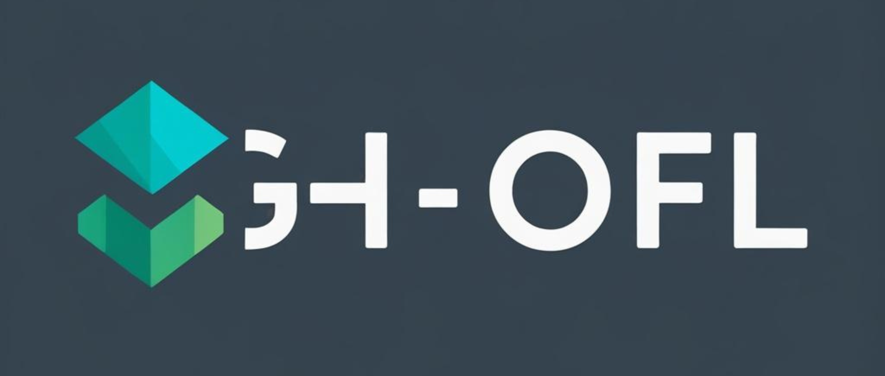

<p align="center">
  
</p>

# GH-OFL — The Gaussian Head Family  
### One-Shot Federated Learning from Client Global Statistics  
**ICLR 2026 — Official Camera-Ready Implementation**

---

## 📌 Overview

**GH-OFL (Gaussian-Head One-Shot Federated Learning)** is a statistics-driven federated learning framework where clients transmit global feature statistics only, enabling server-side closed-form and lightweight trainable classifiers — without gradient exchange, multi-round optimization, or raw data transmission.

This repository contains the refined camera-ready implementation associated with:

Turazza, Picone, Mamei.  
*The Gaussian-Head OFL Family: One-Shot Federated Learning from Client Global Statistics.*  
ICLR 2026.

📄 Paper: https://arxiv.org/abs/2602.01186

---

# 🧠 Core Idea

Instead of sharing gradients or local model weights, each client computes and transmits:

- Per-class feature sums (A)
- Per-class diagonal second moments (SUMSQ)
- Full per-class covariance accumulators (S) — optional
- Global second-order matrix (B = Σ xᵀx)

The server reconstructs Gaussian decision heads analytically and optionally refines them in a Fisher subspace.

✔ One-shot communication  
✔ Statistics-only federation  
✔ No gradient aggregation  
✔ No raw data exchange  
✔ No iterative client training  

---

# 📊 Implemented Heads

## Closed-Form (x-space)

- **GH-NBdiag** — Diagonal Gaussian classifier  
- **GH-LDA** — Pooled covariance (shrinkage)  
- **GH-QDAfull** — Full class covariance (GPU optimized)

## Trainable (Fisher space)

- **FisherMix** — Cosine classifier on Fisher projections  
- **Proto-Hyper** — Low-rank residual adapter with knowledge distillation  

Proto-Hyper:

Student(z_f) = Standardize(LDA_f(z_f)) + Residual(z_f)  
Teacher = λ·QDA_f + (1−λ)·LDA_f  
Loss = KL + CE  

Inference uses only the student.

---

# 📁 Repository Structure

```
GH-OFL/
│
├── client/
│   ├── run_client.py
│   └── run_client_c100c.py
│
├── server/
│   ├── run_server.py
│   └── run_server_c100c.py
│
├── configs/
│   ├── cifar10.yaml
│   ├── cifar100.yaml
│   ├── svhn.yaml
│   └── cifar100c.yaml
│
├── data/
├── client_stats_X/
├── assets/
└── README.md
```

---

# ⚙️ Requirements

- Python ≥ 3.9  
- PyTorch ≥ 2.0  
- Torchvision ≥ 0.15  
- CUDA optional (recommended)

Install:

```bash
pip install torch torchvision numpy pyyaml
```

---

# 🚀 How to Run

---

## STEP 1 — Generate Client Statistics

### CIFAR-10
```bash
python client/run_client.py --config configs/cifar10.yaml
```

### CIFAR-100
```bash
python client/run_client.py --config configs/cifar100.yaml
```

### SVHN
```bash
python client/run_client.py --config configs/svhn.yaml
```

### CIFAR-100-C (robustness training split)
```bash
python client/run_client_c100c.py --config configs/cifar100c.yaml
```

Client behavior:

1. Downloads dataset automatically (if missing).
2. Applies Dirichlet split (α in YAML).
3. Extracts 512-dim features via ResNet-18 (ImageNet).
4. Accumulates float64 statistics.
5. Saves client payloads to:

```
client_stats_X/{DATASET}/resnet18-IMAGENET1K_V1_TRAIN_A{alpha}_X512/
```

---

## STEP 2 — Run Server Evaluation

### CIFAR-10
```bash
python server/run_server.py --config configs/cifar10.yaml
```

### CIFAR-100
```bash
python server/run_server.py --config configs/cifar100.yaml
```

### SVHN
```bash
python server/run_server.py --config configs/svhn.yaml
```

### CIFAR-100-C (robustness evaluation)
```bash
python server/run_server_c100c.py --config configs/cifar100c.yaml
```

Server performs:

1. Aggregation of client statistics
2. GH-NBdiag
3. GH-LDA
4. GH-QDAfull (if S exists)
5. Fisher subspace construction
6. Gaussian synthesis
7. FisherMix training
8. Proto-Hyper training
9. Streaming evaluation

---

# 🧪 CIFAR-100-C Robustness

The CIFAR-100-C scripts use the official Zenodo release.

On first execution, the dataset is automatically downloaded (~1.3GB) and extracted to:

```
data/CIFAR-100-C/
```

Default protocol (paper-standard):

- All 19 corruptions
- Severity 5
- 190,000 evaluation images

This is significantly heavier than CIFAR-100 clean (10,000 images).

---

# 🔄 Switching Dirichlet α

Edit in YAML:

```yaml
dirichlet_alpha: 0.1
```

Then rerun client + server.

Statistics are stored in separate folders automatically.

---

# 🖥 Device Behavior

- Aggregation: CPU float64
- QDAfull: GPU float32 (Cholesky)
- Fisher heads: GPU if available
- Fully CPU compatible

---

# ⚠ Reproducibility Note

Minor deviations from paper tables may occur due to:

- Shrinkage stabilization improvements
- Covariance symmetrization
- Deterministic seed control
- Hardware floating-point variation

The implementation remains fully consistent with the theoretical formulation.

---

# 📖 Citation

```bibtex
@inproceedings{turazza2026ghofl,
  title={The Gaussian-Head OFL Family: One-Shot Federated Learning from Client Global Statistics},
  author={Turazza Fabio, Picone Marco and Mamei Marco},
  booktitle={ICLR},
  year={2026}
}
```

---

Department of Sciences and Methods for Engineering (DISMI)  
Artificial Intelligence Research and Innovation Center (AIRI)  
University of Modena and Reggio Emilia, Italy  

---

## GH-OFL  
### Rethinking Federation Beyond Gradient Aggregation
