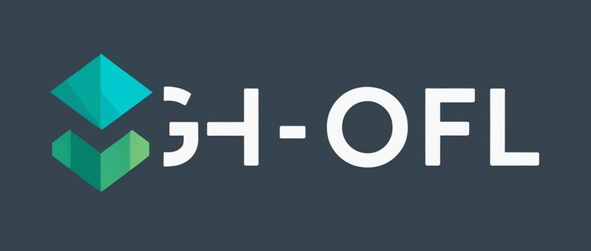

<p align="center">
  
</p>

# GH-OFL — The Gaussian Head Family  
### One-Shot Federated Learning from Client Global Statistics  
**ICLR 2026 — Official Camera-Ready Implementation**

---

## 📌 Overview

**GH-OFL (Gaussian-Head One-Shot Federated Learning)** is a statistics-driven federated learning framework where clients transmit only global feature statistics, enabling fully server-side closed-form and lightweight trainable classifiers — without gradient exchange, multi-round optimization, or raw data transmission.

Turazza, Picone, Mamei.  
*The Gaussian-Head OFL Family: One-Shot Federated Learning from Client Global Statistics.*  
ICLR 2026.  
📄 https://arxiv.org/abs/2602.01186

---

# 🧠 Core Idea

Each client:

1. Uses a frozen ImageNet backbone  
2. Applies a deterministic Dirichlet split  
3. Computes X-space sufficient statistics (float64 accumulation)  
4. Sends only statistics (no gradients, no raw data)  

The server:

- Reconstructs Gaussian heads analytically  
- Builds a Fisher subspace  
- Optionally trains lightweight heads  
- Evaluates in streaming mode  

✔ One-shot communication  
✔ Statistics-only federation  
✔ No gradients  
✔ No raw data  
✔ No multi-round optimization  

---

# 📊 Implemented Heads

## Closed-Form (x-space)

- **GH-NBdiag**  
- **GH-LDA**  
- **GH-QDAfull** (requires full class covariance S)  

## Trainable (Fisher space)

- **FisherMix (Linear head)**  
- **Proto-Hyper (NB-base residual + KD)**  

### Proto-Hyper (camera-ready variant)

Base:
```python
NB_f(z_f)
```

Teacher:
```python
lambda_ * LDA_f(z_f) + (1 - lambda_) * NB_f(z_f)
```

Student:
```python
Student(z_f) = NB_f(z_f) + Residual(z_f)
```

Loss:
```python
alpha * KL + (1 - alpha) * CE
```

Inference uses only the student.

---

# 📁 Repository Structure

```
GH-OFL/
│
├── client/
│   └── run_client_backbones.py
│
├── server/
│   ├── GH_OFL_server.py
│   └── __init__.py
│
├── models/
│   ├── backbones.py
│   └── __init__.py
│
├── configs/
│   ├── cifar10.yaml
│   ├── cifar100.yaml
│   ├── svhn.yaml
│   ├── cifar100c.yaml
│   ├── flowers102.yaml
│   └── aircraft.yaml
│
├── client_stats_X/
├── client_stats/
├── data/
└── assets/
```

---

# ⚙️ Requirements

- Python ≥ 3.9  
- PyTorch ≥ 2.0  
- Torchvision ≥ 0.15  

Install:

```bash
pip install torch torchvision numpy pyyaml
```

---

# 🚀 Full Pipeline

Run everything from the project root.

---

## STEP 1 — Generate Client Statistics (X-space)

This uses the camera-ready client:

- Frozen backbone  
- Deterministic Dirichlet split  
- Float64 accumulation  
- Pure X-space (no RP)  

### CIFAR-10

```bash
python -m client.run_client --config configs/cifar10.yaml
```

### CIFAR-100

```bash
python -m client.run_client --config configs/cifar100.yaml
```

### SVHN

```bash
python -m client.run_client --config configs/svhn.yaml
```

---

### Example YAML Configuration

```yaml
dataset: cifar10
num_clients: 10
dirichlet_alpha: 0.1
backbone: resnet18
seed: 42
batch_size: 512
data_root: ./data
out_root: ./client_stats_X
```

---

### Output Directory Format

```
client_stats_X/{DATASET}/
  {backbone}-{weights_tag}_TRAIN_A{alpha}_X{feature_dim}/
    client_00.pt
    ...
    client_09.pt
```

Example:

```
client_stats_X/CIFAR10/resnet18-IMAGENET1K_V1_TRAIN_A0p1_X512/
```

---

# CIFAR-100-C Protocols

## Clean-Train → Robust-Test (X-space)

If YAML contains:

```yaml
dataset: cifar100c
```

The client computes statistics from CIFAR-100 clean train,  
and the server evaluates on CIFAR-100-C corruptions.

---

## Legacy Holdout / Cross-Corruption

Legacy stats live under:

```
client_stats/CIFAR100C_HOLDOUT/resnet18-IMAGENET1K_V1/
```

Server YAML must explicitly point there:

```yaml
cifar100c_mode: legacy_holdout
cifar100c_stats_dir: ./client_stats/CIFAR100C_HOLDOUT/resnet18-IMAGENET1K_V1
cifar100c_backbone_dir: resnet18-IMAGENET1K_V1
```

---

## STEP 2 — Run Server

Always use module mode:

### CIFAR-10

```bash
python -m server.GH_OFL_server --config configs/cifar10.yaml
```

### CIFAR-100

```bash
python -m server.GH_OFL_server --config configs/cifar100.yaml
```

### SVHN

```bash
python -m server.GH_OFL_server --config configs/svhn.yaml
```

### Flowers-102

```bash
python -m server.GH_OFL_server --config configs/flowers102.yaml
```

### Aircraft

```bash
python -m server.GH_OFL_server --config configs/aircraft.yaml
```

### CIFAR-100-C

```bash
python -m server.GH_OFL_server --config configs/cifar100c.yaml
```

---

# 📊 Server Pipeline

1. Aggregate client statistics  
2. GH-NBdiag  
3. GH-LDA  
4. GH-QDAfull (if S exists)  
5. Fisher subspace construction  
6. Gaussian synthesis  
7. FisherMix training (linear)  
8. Proto-Hyper training (NB-base + residual)  
9. Streaming evaluation  

---

# 📂 Dataset Location

Expected:

```
data/
```

For CIFAR-100-C:

```
data/CIFAR-100-C/
```

If missing, it is downloaded automatically.

---

# 🔄 Changing Dirichlet α

Edit YAML:

```yaml
dirichlet_alpha: 0.1
```

Then rerun:

1. Client  
2. Server  

Statistics are stored in alpha-tagged folders.

---

# 📖 Citation

```bibtex
@inproceedings{turazza2026ghofl,
  title={The Gaussian-Head OFL Family: One-Shot Federated Learning from Client Global Statistics},
  author={Turazza, Fabio and Picone, Marco and Mamei, Marco},
  booktitle={ICLR},
  year={2026}
}
```

---

Department of Sciences and Methods for Engineering (DISMI)  
Artificial Intelligence Research and Innovation Center (AIRI)  
University of Modena and Reggio Emilia, Italy  

---

## GH-OFL  
Rethinking Federation Beyond Gradient Aggregation
